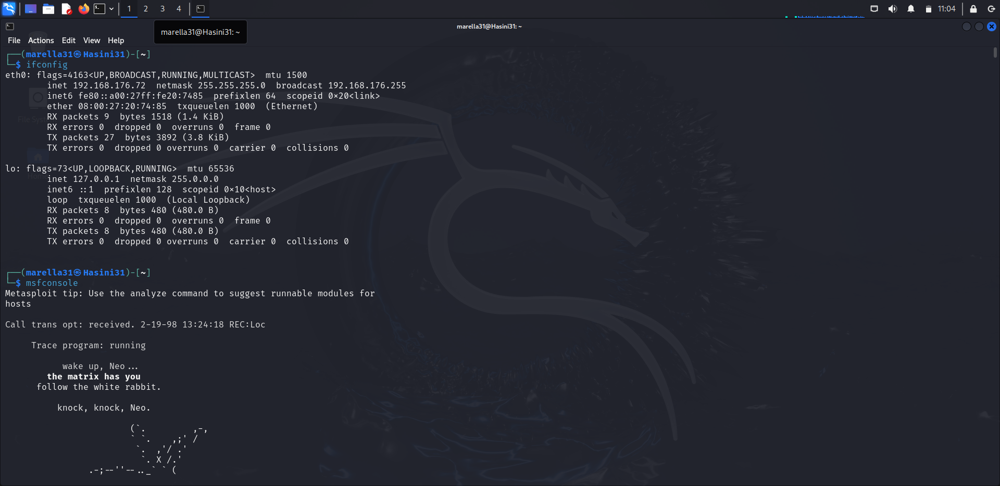
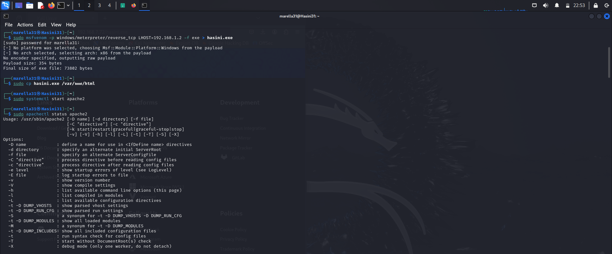
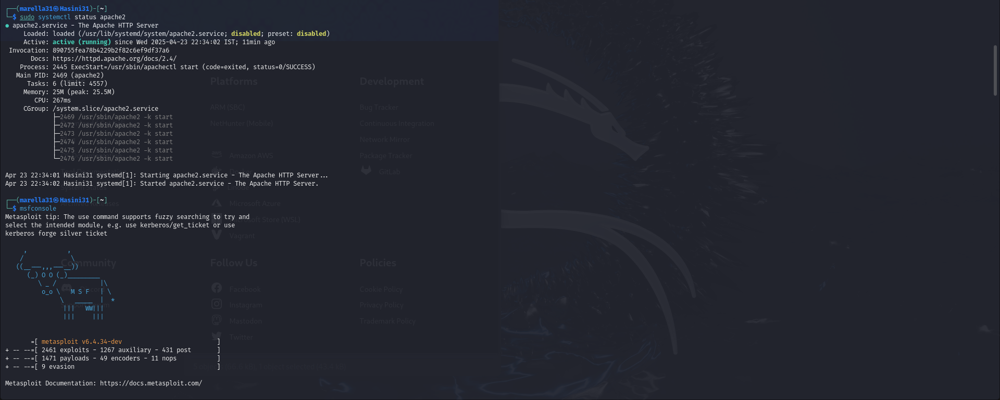
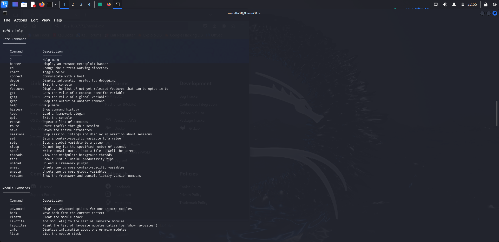
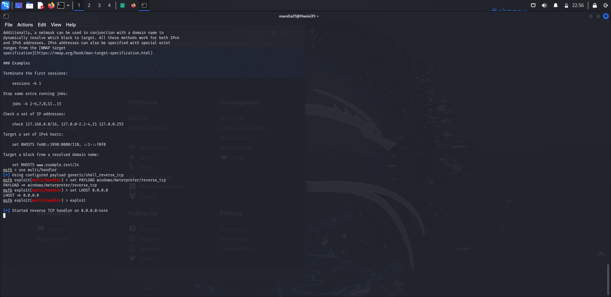
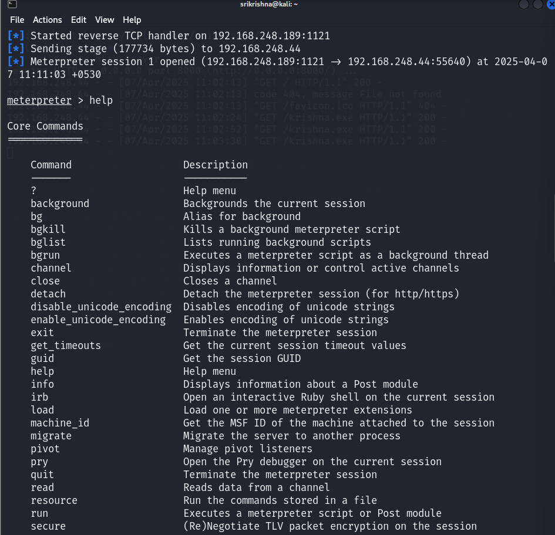
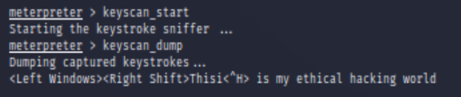

# Compromising-windows-using-Metasploit
Compromising windows using Metasploit
# Metasploit
Compromising windows using Metasploit

# AIM:

To Compromise windows using Metasploit .

## DESIGN STEPS:

### Step 1:

Install kali linux either in partition or virtual box or in live mode

### Step 2:

Investigate on the various categories of tools as follows:

### Step 3:

Open terminal and try execute some kali linux commands

## EXECUTION STEPS AND ITS OUTPUT:

1. Find the attackers ip address using ifconfig:
## OUTPUT:

2. Generate Payload Using msfvenom:

Execute the following command to generate a Windows Meterpreter reverse shell payload.exe 
## OUTPUT:

## step3.Invoke msfconsole:

## step 4.SetUp an HTTP Server:

## Step5:Distribute the Payload:

## Step6: Establish a Connection:

## Step7:List Commands:

## Step8:

## RESULT:
The Metasploit framework is  used to compromise windows and is examined successfully.
